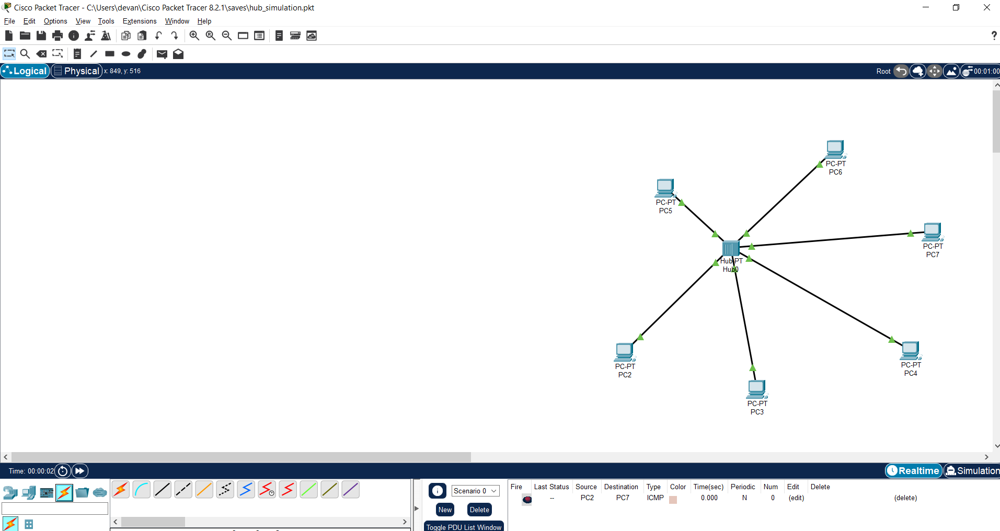
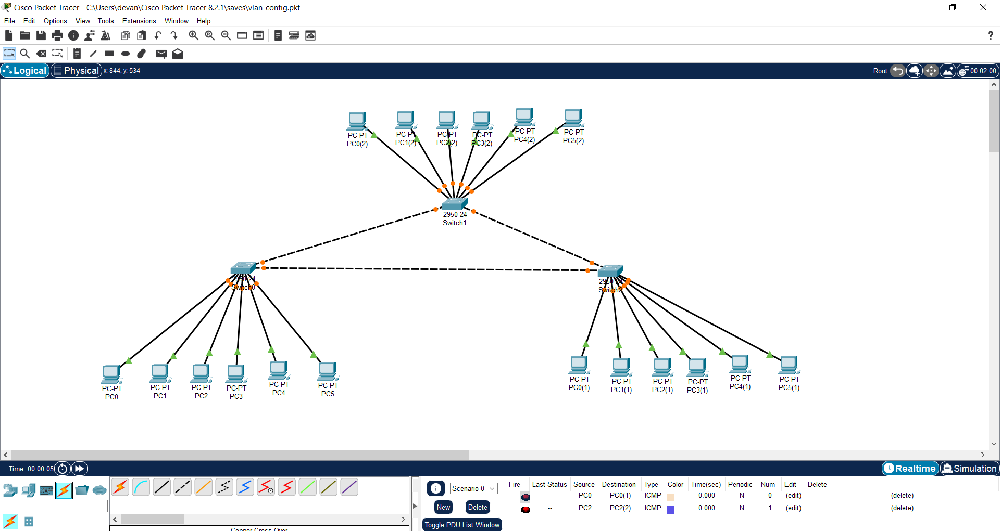
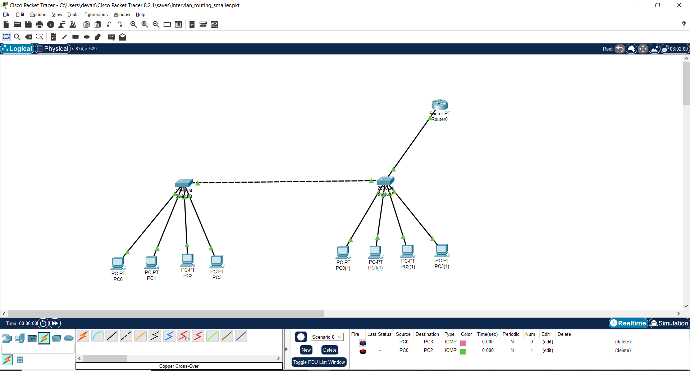

# Network-Slicing
Network Slicing and it's issues, Nework Simulation and Inter-VLAN Routing using Cisco Packet Tracer 

### Why do we need network slicing?

Network slicing is a technique used to partition a single physical network infrastructure into multiple logical networks, each with its own resources, security, and quality of service (QoS) parameters. Network slicing is used in various scenarios, such as 5G mobile networks, internet of things (IoT), and cloud computing. Here are some reasons why we need network slicing:
1.	Efficient resource utilization: Network slicing allows the sharing of a single physical network infrastructure among multiple logical networks, enabling efficient utilization of network resources. Each network slice can be customized according to its specific requirements, such as bandwidth, latency, and security.
2.	Customized services: Network slicing enables the creation of customized services tailored to specific use cases, such as mobile broadband, smart cities, or autonomous vehicles. Each network slice can be optimized for its intended use case, providing a more efficient and reliable service.
3.	Enhanced security: Network slicing enables the implementation of end-to-end security policies for each network slice, ensuring that sensitive data is protected and preventing unauthorized access.
4.	Improved scalability: Network slicing enables the creation of new logical networks quickly and easily, allowing for improved scalability and flexibility.
5.	QoS management: Network slicing enables the implementation of QoS policies for each network slice, ensuring that the network resources are allocated appropriately based on the specific requirements of each service.
Overall, network slicing is an important technique for enabling efficient and customized network services, improving network scalability, and enhancing security and QoS management.

### Network Slicing using Network Packet Tracer

1.	We need to setup 2 or 3 VLANs over the physical network configuration, and then make these VLANs/slices interact with each other using any of the 3 methods (router on a stick configuration using subinterfaces, multilayer switch, or separate gateway). I have used router-on-a-stick-configuration.
2.	I set up 2 switches and connected 4 PCs each as end devices. 
3.	2 of the end devices were under VLAN 10 in each switch, and the other under VLAN 20.
4.	All devices of the same type were connected with copper cross-over wires and different type wires are connected with copper straight-through wires.
5.	Setup IPs and default gateway of the PC, make sure IPs of PCs in different VLANs must have different NID.
6.	Set up the hubs and initialize VLANs in CLI.
7.	Connect the router to one of the switches, and configure a trunk link between the router and the switch.
8.	Set up the router and 2 subinterfaces, with their IP address same as the default gateways, and subnet mask according to IP address class.
9.	Ping from one VLAN to another, and it should work.

*fig1. Hub simulation*

*fig2. VLAN Configuration/ Network Slicing*

*fig3. Inter VLAN Configuration of 2 VLANs*

### What are the major drawbacks of 5G network slicing?
While network slicing holds tremendous potential for 5G networks, it has its fair share of hurdles. While there is agreement on the pivotal role of network slicing in 5G, the procedure for its implementation needs to be figured out.
●	As 5G networks offer wireless connectivity, it will be essential to re-design Radio Access Networks (RANs) for network slicing. Network slicing is typically applied in the central network region of the 5G network and can be executed in the RAN segment by combining resources. However, for 5G network slicing to be viable, multiple macrocells and small cells need to work in unison to satisfy the requirements of various network slices.  
●	Understanding how best to enable point-to-point connectivity between mechanical controllers and radio devices by combining network slicing with NFV and SDN needs to be established.  
●	While the solitary nature of the deployed technology may restrict interference from network slices, achieving point-to-point connectivity is a challenge with an excess of network slices.  
●	Ensuring network slicing can work with emerging 5G technologies requires extensive interoperability as networks gradually transition to 5G. Communication service providers and network operators must test the interoperability extensively to ensure network slicing works as expected in 5G networks.  
●	Industry experts need to agree on the best route for implementation, which will take some time.  
●	While 5G network slicing leverages an intelligent use of standard radio resources, it needs advanced techniques to guarantee the isolation of these radio resources.  

### Security with 5G network slicing
Network slicing increases network complexity which has security implications. Every network slice carries a different amount of traffic and hence has unique security requirements. The scalability that can be achieved with the help of slicing also opens doors for potential network threats. An attack on the central infrastructure can hamper multiple slices at the same time.

Another security challenge that network slicing presents is data isolation. Protection of information being used on one network slice from being modified by another on the same infrastructure will be a challenge for the operators.

SDN and NFV are also potential threat areas. Attackers can analyse the processing time of a packet using the SDN’s input buffer. Security threats around NFV include attacks on the orchestration management systems, denial of service attacks etc.

Close coordination between operators and enterprises is essential to maintain secure communication across slices. This will ensure the protection of the privacy of users while maintaining the quality of service.
